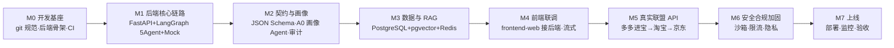
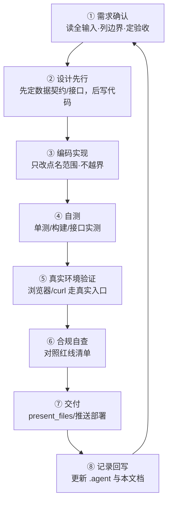

# 智能导购 Agent — 开发流程规范

> 版本：v1.0 ｜ 更新日期：2026-09-13
> 适用范围：`F:\price-agent` 全部后续开发（后端 / 数据库 / 联调 / 真实 API / 上线）
> 依据：`智能电商采购Agent-设计方案.md`（v0.4）+ `.agent` 进度快照
> 约定：本文件是开发流程的**唯一权威入口**；每完成一个里程碑，回写 `.agent` 进度并更新本文件版本号。

---

## 1. 项目现状（起点快照）

| 模块 | 状态 | 说明 |
|------|------|------|
| 前端 `frontend-web/` | ✅ 已上线 | Vue3 + Vite + Tailwind4，GitHub Pages：https://szy0607.github.io/price-agent/ |
| 前端 `frontend/`（Vant） | ✅ Demo 完成 | 参考工程，转正决策见待决事项 |
| 后端 FastAPI + LangGraph | ⬜ 未开始 | 本轮开发起点 |
| 数据库 MySQL + Milvus / Redis | ⬜ 未开始 | 业务库 MySQL；向量库 Milvus（替代原 PG + pgvector，见设计方案 §5） |
| 联盟 API 真实接入 | ⬜ 未开始 | Demo 用 Mock |
| Git | ✅ 就绪 | 本地已关联 `origin/main`（github.com/szy0607/price-agent） |

**开发总目标**：把"前端 Mock Demo"推进为「后端多 Agent + 数据库 + 真实联盟 API + 前端联调」的可用全栈产品，全程守住合规红线。

---

## 2. 总体开发阶段（里程碑）



| 阶段 | 目标 | 关键产出 | 验收标准（退出条件） |
|------|------|---------|---------------------|
| **M0 开发基座** | 让后续开发有规范、可回滚 | 后端目录骨架、配置/日志/trace_id、CI 流水线、git 工作流落地 | 后端可启动返回健康检查；CI 绿；一次 commit 走通规范 |
| **M1 后端核心链路** | 跑通 9 步核心流程（咨询→推荐→双价→领券指引） | FastAPI 服务 + LangGraph 状态图（A1~A5）+ Mock 适配层 4 接口 | 用 curl 全链路调用返回结构化结果；A2/A3 与 A4/A5 权限分离 |
| **M2 契约与画像** | 消灭"Agent 间传自然语言"的幻觉累积 | JSON Schema 契约包 + A0 User Profile Agent + 审计日志（trace_id 可回放） | 契约校验通过；画像解析与前端 `utils/profile.js` 字段对齐 |

| **M3 数据与 RAG** | 知识可检索、价格可缓存 | PostgreSQL 表结构 + pgvector 向量库 + Redis 缓存策略 | 迁移脚本可跑；RAG 检索命中率达标；券缓存 TTL 生效 |
| **M4 前端联调** | Demo 变真数据 | `ChatView.vue` 接后端流式/分步接口 | 浏览器实测 4 页面全链路真数据；构建部署通过 |
| **M5 真实联盟 API** | Mock 换真价 | 统一适配层接多多进宝（先行）→ 淘宝 → 京东 | 三平台字段级核验（对照设计稿 §3.2 能力矩阵） |
| **M6 安全合规加固** | 可对外可用 | 网络白名单、凭据隔离、限流、隐私最小化 | 安全清单逐项勾选；渗透式自查无高危 |
| **M7 上线** | 交付 | 部署脚本、监控告警、验收报告 | 生产可用性验收通过；.agent 结项记录 |

> 阶段可并行部分：M3 的 RAG 知识整理可与 M1/M2 并行；M5 的联盟账号注册（个人推手）尽早启动，注册审核有周期。

---

## 3. 每轮迭代开发流程（日常节奏）

每一轮开发（无论大小）强制走以下 8 步，顺序不可跳：



**每步要点**：

1. **需求确认**——用户意图不明确时先列假设再动手；明确"本次改什么、不碰什么"；新增决策先记入待决事项。
2. **设计先行**——涉及多 Agent / 多端的数据一律先写 JSON Schema 契约与接口签名，评审通过再实现；禁止"边写边想字段"。
3. **编码实现**——遵守 §6 代码规范；只改被点名范围，未要求改动的代码与结论原样保留。
4. **自测**——后端 `pytest`（至少覆盖每个 Agent 的输入→输出契约）；前端 `npm run build` 必须通过；新增逻辑必须有最小可复现验证。
5. **真实环境验证**——不用"文件存在/语法通过"代替验证：后端走 curl 真实请求，前端走浏览器实测（含构建产物），数字逐项核对。
6. **合规自查**——对照 §7 红线清单逐条过；发现越线立即修正，不静默绕过。
7. **交付**——交付物写明路径与打开方式；能直接打开的载体优先（链接 / 本地文件）。
8. **记录回写**——`.agent` 追加"本轮完成/踩坑/下一步"，注明模型与日期。

---

## 4. 数据契约（先于代码，M1/M2 核心）

### 4.1 统一适配层接口（Mock 与真实 API 同签名，M5 只换实现）

```text
search_product(keyword)          → 候选商品列表
get_item_detail(item_id)         → 商品详情 + SKU 款式信息
get_price_with_coupon(item_id)   → 公开价 / 券后价 / 活动价
get_coupon_info(item_id)         → 券类型 / 面额 / 使用限制 / 领券路径
```

### 4.2 Agent 间契约（JSON Schema，禁止传自然语言）

| 契约 | 生产者 → 消费者 | 核心字段 |
|------|----------------|---------|
| `TaskPlan` | A1 → 全部 | intent, targets[{keyword/item_id}], profile |
| `ItemMatrix` | A2 → A3/A4 | product, skus[{sku_id, spec, spec_map}] |
| `PriceMatrix` | A3 → A4/A5 | sku_id, prices{taobao, jd, pdd}{a, b, coupon, code, sales, plus?, subsidy?} |
| `CompareResult` | A4 → A5 | dimensions[], diffs[], conclusion |
| `FinalReply` | A5 → 前端 | summary, recommendation, coupons[], disclaimer |

> 价格字段结构必须与前端 `src/mock/data.js` 的三平台结构一致（`prices{taobao,jd,pdd}`），M4 联调时前端零结构改动。

### 4.3 用户画像契约（A0 后端化）

- 字段与解析规则以 `frontend-web/src/utils/profile.js` 为准（budget / platform_pref / student / price_sensitivity / membership）。
- 后端化后前端只读结果；持久化方案与隐私删除接口在 M3 一并落库。

---

## 5. Git 与协作规范

| 项 | 规范 |
|----|------|
| 分支模型 | `main` 为稳定分支；功能开发开 `feat/<里程碑>-<模块>` 分支，合入 `main` 前走 PR |
| Commit 规范 | `<type>(<scope>): <subject>`，type ∈ feat/fix/refactor/docs/test/chore；中文 subject，一行 ≤50 字 |
| 提交粒度 | 一个逻辑变更一个 commit；禁止把无关改动混入同一 commit |
| 合入要求 | PR 必须：构建通过 + 关键路径实测记录 + 合规自查勾选，三者缺一不可 |
| 代理环境 | 直连 github.com 超时需走系统代理 `http://127.0.0.1:7890`（已在 .agent 记录） |
| 破坏性操作 | 删除/覆盖/发布由系统弹窗确认；用户明确拒绝的操作不换写法重试 |

---

## 6. 代码与质量规范


- **后端**：Python 3.11+，FastAPI + LangGraph；PEP-484 类型注解；依赖用 `requirements.txt`（或 uv 锁文件）锁定。
- **前端**：沿用 `frontend-web/` 现有栈（Vue3 + Vite + Tailwind4）；不另起配色，双价颜色变量在 `styles/main.css`（A=公开价红 `--price-a`，B=领券价绿 `--price-b`）。
- **命名**：全文用「查询/采集/情报」，禁用「爬取」字样（合规敏感）。
- **测试**：后端每个 Agent 至少一个契约测试；前端改动后 `npm run build` + 浏览器实测。
- **安全编码**：不引入命令注入 / XSS / SQL 注入；外部数据（联盟 API 返回）只在 A2/A3 隔离层清洗，绝不直接进 LLM 指令上下文。
- **warning 处理**：构建/测试警告必须处理或记录原因，不许带病交付。

---

## 7. 合规红线（不可回退，每次交付前逐条自查）

| # | 红线 | 说明 |
|---|------|------|
| 1 | 零交易动作 | 系统不做任何下单/支付/资金动作，交易 100% 用户完成 |
| 2 | 不提供 CPS 推广链接 | 只做查券信息聚合与领券指引，与推广解耦 |
| 3 | 双价透明展示 | 隐藏券/渠道专享券必须同时给「能领/领不到」两个价，不误导 |
| 4 | 千人千面权益不承诺 | 天降红包/限时折扣等账号维度权益只指引、注明"以页面实时价为准" |
| 5 | 禁用爬取 | 信息一律走官方联盟 API 查询，不碰评论区/反爬技术 |
| 6 | 隐私最小化 | 画像最小化采集、加密存储、用户可删除（PIPL） |
| 7 | 数据契约隔离 | Agent 间只传结构化契约，外部原始数据不进指令上下文 |
| 8 | 审计可回放 | 每次查询带 trace_id，输入/输出全量记录 |

---

## 8. 风险清单与应对

| 风险 | 影响 | 应对 |
|------|------|------|
| 联盟账号注册/审核周期长 | 阻塞 M5 | M0 起并行注册（优先多多进宝），先用 Mock 保链路 |
| 联盟 API 字段与设计稿不符 | 双价/优惠展示失真 | 字段级核验（对照设计稿 §3.2 矩阵）；以接口实测为准修订契约 |
| LangGraph 多 Agent 状态复杂度失控 | 链路难调试 | 状态图先行评审；每 Agent 单测 + trace_id 全链路日志 |
| 前端联调结构不匹配 | 返工 | M1 起强制契约先行；价格结构对齐 `mock/data.js` |
| 数据源返回恶意内容（Prompt 注入） | 安全 | A2/A3 隔离层清洗；外部数据与指令分离 |
| 预算解析等正则/规则 bug | 画像失真 | 沿用 .agent 踩坑记录（§3#17）；画像解析补单测 |
| GitHub Actions 缓存/网络问题 | 部署失败 | 沿用已修复方案：去掉 npm 缓存 + `npm cache clean --force` + base 路径配置 |

---

## 9. 待决事项（⏳，开工前先拍板影响面大的）

| # | 决策点 | 倾向 | 影响 |
|---|--------|------|------|
| 1 | 前端二选一冻结 | `frontend-web/` 转正 | 决定 M4 联调目标与是否冻结 Vant 版 |
| 2 | 首批真实数据源 | 多多进宝先行 | 决定 M5 优先级与注册动作 |
| 3 | LLM 接口选型 | OpenAI / Anthropic function calling | 决定 LangGraph 绑定方式 |
| 4 | 后端环境部署目标 | 本机 / 云服务器 | 决定 M7 上线方式 |

---

*本文件随项目演进更新；任何流程调整须先在本文档修订并同步 `.agent`，再执行。*
