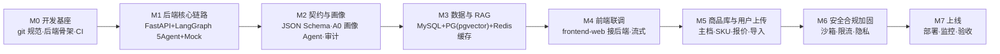
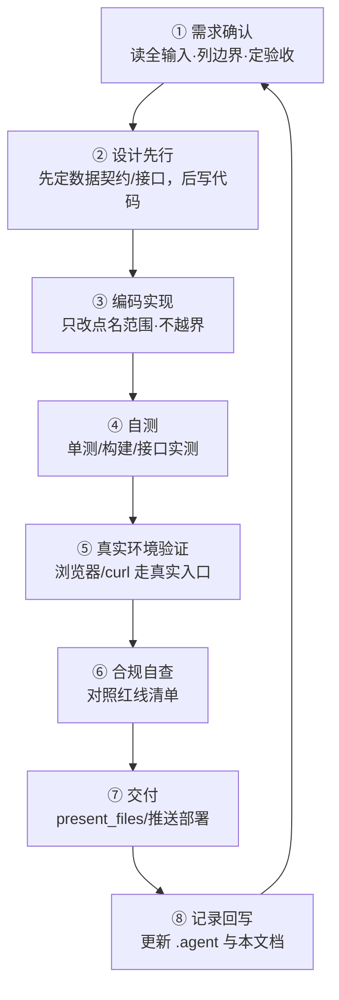

# 智能导购 Agent — 开发流程规范

> 版本：v1.0 ｜ 更新日期：2026-09-28
> 适用范围：`F:\price-agent` 全部后续开发（后端 / 数据库 / 联调 / 真实 API / 上线）
> 依据：`智能电商采购Agent-设计方案.md`（v0.6）+ `.agent` 进度快照
> 约定：本文件是开发流程的**唯一权威入口**；每完成一个里程碑，回写 `.agent` 进度并更新本文件版本号。

---

## 1. 项目现状（起点快照）

| 模块 | 状态 | 说明 |
|------|------|------|
| 前端 `frontend-web/` | ✅ 已上线 | Vue3 + Vite + Tailwind4，GitHub Pages：https://szy0607.github.io/price-agent/ |
| 前端 `frontend/`（Vant） | ✅ Demo 完成 | 参考工程，转正决策见待决事项 |
| 后端 FastAPI + LangGraph | 🟡 M0 基座已落地 | `app/main.py` 已挂 `TraceMiddleware` / `register_exception_handlers` / `setup_logging` / `health_router`；`app/router/health.py` 提供 `GET /health`（含 DB 探活）；`app/core/{trace,middleware,errors,logging,config}.py` 均已在；注册/登录接口已实现。LangGraph 5 Agent 核心链路自 M1 起 |
| 数据库 MySQL + PostgreSQL / Redis | 🟡 M0 基座已落地（业务库 MySQL） | `alembic/versions/f7fa5f121d6e_create_users.py` 已建 `users` 表；业务事实源 **MySQL 8**；知识 / 向量库 **PostgreSQL 16 + pgvector**（M3 启用）；Redis 仅用于 M3/M6 起的缓存与临时状态。口径见契约 **§8** |
| 自建商品信息库 | ⬜ 未开始 | 商品主档、SKU、来源和用户报价；支持手动录入、CSV 导入、图片/文本辅助识别 |
| Git | ✅ 就绪 | 本地已关联 `origin/main`（github.com/szy0607/price-agent） |

**开发总目标**：把"前端 Mock Demo"推进为「后端多 Agent + 自建商品信息库 + 用户上传与确认 + 前端联调」的可用全栈产品，全程守住合规红线。平台 API 作为未来可插拔数据源，不作为当前上线前提。

---

## 2. 总体开发阶段（里程碑）


```mermaid
flowchart LR
    M0["M0 开发基座<br/>git 规范·后端骨架·CI"] --> M1["M1 后端核心链路<br/>FastAPI+LangGraph 5Agent+Mock"]
    M1 --> M2["M2 契约与画像<br/>JSON Schema·A0 画像 Agent·审计"]
    M2 --> M3["M3 数据与 RAG<br/>MySQL+PG(pgvector)+Redis缓存"]
    M3 --> M4["M4 前端联调<br/>frontend-web 接后端·流式"]
    M4 --> M5["M5 商品库与用户上传<br/>主档·SKU·报价·导入"]
    M5 --> M6["M6 安全合规加固<br/>沙箱·限流·隐私"]
    M6 --> M7["M7 上线<br/>部署·监控·验收"]
```

| 阶段 | 目标 | 关键产出 | 验收标准（退出条件） |
|------|------|---------|---------------------|
| **M0 开发基座** | 让后续开发有规范、可回滚 | 后端目录骨架、配置/日志/trace_id、CI 流水线、git 工作流落地 | 后端可启动返回健康检查；CI 绿；一次 commit 走通规范 |
| **M1 后端核心链路** | 跑通咨询→商品识别→对比→推荐流程 | FastAPI 服务 + LangGraph 状态图（A1~A5）+ Mock 商品库适配层 | 用 curl 全链路调用返回结构化结果；A2/A3 与 A4/A5 权限分离 |
| **M2 契约与画像** | 消灭"Agent 间传自然语言"的幻觉累积 | JSON Schema 契约包 + A0 User Profile Agent + 审计日志（trace_id 可回放） | 契约校验通过；画像解析与前端 `utils/profile.js` 字段对齐 |
| **M3 数据与 RAG** | 商品资料、知识可检索，价格与对话上下文可缓存 | MySQL 商品库建表 / 索引；**PostgreSQL 16 + pgvector** 知识库；Redis 对话与短期报价缓存 | 迁移脚本可跑；商品字段与来源可追溯；RAG 检索命中率达标；时效过滤专项验证通过 |
| **M4 前端联调** | Demo 变真数据 | `ChatView.vue` 接后端流式/分步接口 | 浏览器实测 4 页面全链路真数据；构建部署通过 |
| **M5 商品库与用户上传** | 让商品数据从 Mock 变成可维护资料 | 商品主档、SKU、来源、用户报价、导入任务；手动录入、CSV、图片/文本辅助识别；草稿→确认→可用 | 用户可创建、修改、归档商品；报价带来源和时间；导入失败可重试；个人数据严格隔离 |
| **M6 安全合规加固** | 可对外可用 | 网络白名单、凭据隔离、限流、隐私最小化 | 安全清单逐项勾选；渗透式自查无高危 |
| **M7 上线** | 交付 | 部署脚本、监控告警、验收报告 | 生产可用性验收通过；.agent 结项记录 |

> 阶段可并行部分：M3 的商品资料与 RAG 知识整理可与 M1/M2 并行；未来如获得平台 API，再作为独立适配器接入，不阻塞主线。

---

## 3. 每轮迭代开发流程（日常节奏）

每一轮开发（无论大小）强制走以下 8 步，顺序不可跳：


```mermaid
flowchart TD
    S1["① 需求确认<br/>读全输入·列边界·定验收"] --> S2["② 设计先行<br/>先定数据契约/接口，后写代码"]
    S2 --> S3["③ 编码实现<br/>只改点名范围·不越界"]
    S3 --> S4["④ 自测<br/>单测/构建/接口实测"]
    S4 --> S5["⑤ 真实环境验证<br/>浏览器/curl 走真实入口"]
    S5 --> S6["⑥ 合规自查<br/>对照红线清单"]
    S6 --> S7["⑦ 交付<br/>present_files/推送部署"]
    S7 --> S8["⑧ 记录回写<br/>更新 .agent 与本文档"]
    S8 --> S1
```

**每步要点**：

1. **需求确认**——用户意图不明确时先列假设再动手；明确"本次改什么、不碰什么"；新增决策先记入待决事项。
2. **设计先行**——涉及多 Agent / 多端的数据一律先写 JSON Schema 契约与接口签名，评审通过再实现；禁止"边写边想字段"。
3. **编码实现**——遵守 §6 代码规范；只改被点名范围，未要求改动的代码与结论原样保留。
4. **自测**——后端 `pytest`（至少覆盖每个 Agent 的输入→输出契约）；前端 `npm run build` 必须通过；新增逻辑必须有最小可复现验证。
5. **真实环境验证**——不用"文件存在/语法通过"代替验证：后端走 curl 真实请求，前端走浏览器实测（含构建产物），数字逐项核对。
6. **合规自查**——对照 §7 红线清单逐条过；发现越线立即修正，不静默绕过。
7. **交付**——交付物写明路径与打开方式；能直接打开的载体优先（链接 / 本地文件）。
8. **记录回写**——`.agent` 追加"本轮完成/踩坑/下一步"，注明模型与日期。

---

## 4. 数据契约（先于代码，M1/M2 核心）

### 4.1 统一商品数据接口（商品库为当前事实源，外部 API 可插拔）

```text
search_products(keyword, scope)  → 库内候选商品列表（public | mine）
get_product_detail(product_id)   → 商品主档 + SKU + 已确认来源
list_quotes(product_id)          → 用户录入或导入的报价记录（带时间/来源）
create_import_task(payload)      → 创建上传解析任务，返回待确认字段
confirm_import(task_id, fields)  → 用户确认后写入个人商品库
```

> 当前不要求任何联盟 API。`scope=mine` 只能访问当前用户的数据；公共商品只能读取已审核内容。外部页面或未来平台 API 只能作为导入来源，原始内容必须先清洗并进入待确认状态。

### 4.2 Agent 间契约（JSON Schema，禁止传自然语言）

| 契约 | 生产者 → 消费者 | 核心字段 |
|------|----------------|---------|
| `TaskPlan` | A1 → 全部 | intent, targets[{keyword/item_id}], profile |
| `ItemMatrix` | A2 → A3/A4 | product, skus[{sku_id, spec, spec_map}] |
| `PriceMatrix` | A3 → A4/A5 | sku_id, quotes[{platform, price, currency, observed_at, source_type, source_ref, confidence}] |
| `CompareResult` | A4 → A5 | dimensions[], diffs[], conclusion |
| `FinalReply` | A5 → 前端 | summary, recommendation, coupons[], disclaimer |

> 新口径不承诺实时券后价。价格必须带 `observed_at`、`source_type` 和 `source_ref`，前端展示“记录时间/来源”；缺少确认报价时显示“暂无价格记录”。旧 Mock 的三平台字段只作为兼容适配，不再作为事实契约。

### 4.4 商品库数据边界

- 商品主档：品牌、名称、型号、分类、描述、图片和稳定规格。
- SKU：颜色、尺寸、容量、套餐等可选变体；SKU 不与商品主档混写。
- 来源：用户录入、CSV、截图/文本识别、公开页面辅助提取；记录原始来源和确认人。
- 报价：平台、金额、币种、记录时间、优惠说明、链接或截图引用；报价是带时间的观察值，不是永久事实。
- 状态：`draft`（待确认）、`published`（可用于本人检索/已审核公共数据）、`archived`（归档）。
- 用户上传内容默认属于个人空间；未经用户明确授权和审核，不进入公共商品库，也不用于跨用户推荐。

### 4.3 用户画像契约（A0 后端化）

- 字段设计意图：`budget`（预算）/ `platform_pref`（平台偏好）/ `student`（学生身份）/ `price_sensitivity`（价格敏感度）/ `membership`（会员身份）；字段与解析规则以 `frontend-web/src/utils/profile.js` 为准，前端实现名为 camelCase：`budget / preferredPlatform / student / priceSensitive / qualityFirst / membership`（`qualityFirst`=品质优先）。
- 后端化后前端只读结果；持久化方案与隐私删除接口在 M3 一并落库。

---

## 5. Git 与协作规范

| 项 | 规范 |
|----|------|
| 分支模型 | `main` 为稳定分支；功能开发开 `feat/<里程碑>-<模块>` 分支，合入 `main` 前走 PR |
| Commit 规范 | `<type>(<scope>): <subject>`，type ∈ feat/fix/refactor/docs/test/chore；中文 subject，一行 ≤50 字 |
| 提交粒度 | 一个逻辑变更一个 commit；禁止把无关改动混入同一 commit |
| 合入要求 | PR 必须：构建通过 + 关键路径实测记录 + 合规自查勾选，三者缺一不可 |
| 代理环境 | 直连 github.com 超时需走系统代理 `http://127.0.0.1:7890`（已在 .agent 记录） |
| 破坏性操作 | 删除/覆盖/发布由系统弹窗确认；用户明确拒绝的操作不换写法重试 |

---

## 6. 代码与质量规范


- **后端**：Python 3.10+，FastAPI + LangGraph；PEP-484 类型注解；依赖用 `requirements.txt` 做范围约束（未锁定）。
- **前端**：沿用 `frontend-web/` 现有栈（Vue3 + Vite + Tailwind4）；不另起配色，网页版双价颜色变量在 `frontend-web/src/style.css`（A=公开价红 `--price-a`，B=领券价绿 `--price-b`）；移动版 Demo 双价颜色变量在 `frontend/src/styles/main.css`。
- **命名**：全文用「查询/采集/导入/情报」，不把不稳定的页面读取能力称为核心数据源；不绕过登录、验证码或反爬措施。
- **测试**：后端每个 Agent 至少一个契约测试；前端改动后 `npm run build` + 浏览器实测。
- **安全编码**：不引入命令注入 / XSS / SQL 注入；用户上传、公开页面或未来 API 返回的原始内容只在导入隔离层清洗，绝不直接进 LLM 指令上下文。
- **warning 处理**：构建/测试警告必须处理或记录原因，不许带病交付。

---

## 7. 合规红线（不可回退，每次交付前逐条自查）

| # | 红线 | 说明 |
|---|------|------|
| 1 | 零交易动作 | 系统不做任何下单/支付/资金动作，交易 100% 用户完成 |
| 2 | 不提供 CPS 推广链接 | 商品库保存普通商品链接或来源引用，不生成推广链路 |
| 3 | 价格透明展示 | 每个报价显示记录时间、来源和确认状态；过期或未确认数据不得伪装成实时价 |
| 4 | 个性化权益不承诺 | 会员价、红包、限时折扣等只作为用户备注或指引，不参与无依据的最低价结论 |
| 5 | 不绕过平台限制 | 可读取的公开信息仅作为辅助导入；不绕过登录、验证码、签名或反爬措施，不抓取评论区 |
| 6 | 隐私最小化 | 画像最小化采集、加密存储、用户可删除（PIPL） |
| 7 | 数据契约隔离 | Agent 间只传结构化契约，外部原始数据不进指令上下文 |
| 8 | 审计可回放 | 每次查询带 trace_id，输入/输出全量记录 |

---

## 8. 风险清单与应对

| 风险 | 影响 | 应对 |
|------|------|------|
| 商品库冷启动数据不足 | 推荐结果少 | 先用种子商品 + 用户导入；推荐结果不足时明确提示，不硬凑 Top N |
| 用户上传字段不完整或错误 | 对比结果失真 | AI 只做候选提取；必须进入草稿并由用户确认；保留来源和修改记录 |
| 报价过期 | 价格误导 | 报价带观察时间和有效期；前端显示“记录价”，不宣称实时最低价 |
| 公共库被低质或恶意内容污染 | 推荐和检索失真 | 公共库审核、去重、版本和举报；个人库与公共库权限隔离 |
| LangGraph 多 Agent 状态复杂度失控 | 链路难调试 | 状态图先行评审；每 Agent 单测 + trace_id 全链路日志 |
| 前端联调结构不匹配 | 返工 | M1 起强制契约先行；价格结构对齐 `mock/data.js` |
| 数据源返回恶意内容（Prompt 注入） | 安全 | A2/A3 隔离层清洗；外部数据与指令分离 |
| 预算解析等正则/规则 bug | 画像失真 | 沿用 .agent 踩坑记录（§3#17）；画像解析补单测 |
| GitHub Actions 缓存/网络问题 | 部署失败 | 沿用已修复方案：去掉 npm 缓存 + `npm cache clean --force` + base 路径配置 |

---

## 9. 待决事项（⏳，开工前先拍板影响面大的）

| # | 决策点 | 倾向 | 影响 |
|---|--------|------|------|
| 1 | 前端二选一冻结 | `frontend-web/` 转正 | 决定 M4 联调目标与是否冻结 Vant 版 |
| 2 | 商品库共享范围 | 个人库先行，公共库审核后开放 | 决定商品权限、审核和去重规则 |
| 3 | LLM 接口选型 | OpenAI / Anthropic function calling | 决定 LangGraph 绑定方式 |
| 4 | 后端环境部署目标 | 本机 / 云服务器 | 决定 M7 上线方式 |

---

*本文件随项目演进更新；任何流程调整须先在本文档修订并同步 `.agent`，再执行。*
