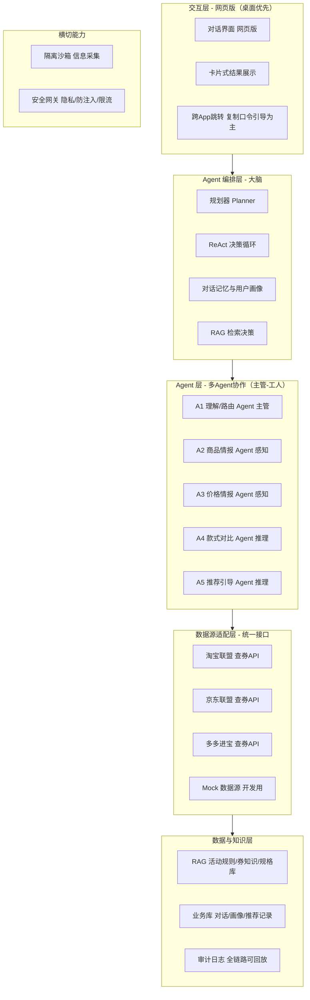
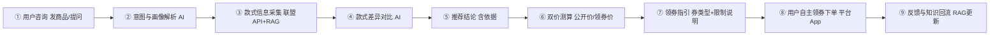

# 智能导购 Agent（购物决策助手）— 设计方案底稿

> 状态：**v0.4 开发目标定为网页版** · 共同设计讨论用文档，可直接在本文件修改
> 更新日期：2026-09-13
> 版本说明：v0.1 为"智能电商采购 Agent"（AI 自动下单），经可行性论证后转型为 **v0.2 智能导购 Agent**——AI 只做信息聚合与决策建议，交易 100% 由用户完成，合规风险大幅降低；**v0.3 价格情报优化**——联盟 API 字段级能力扩充（PLUS 价/百亿补贴/促销利益点）、新增"优惠类型获取策略"、明确禁用评论区爬虫；**v0.4 网页版定位**——开发目标调整为"网页版（桌面优先）"，小程序/App 降级为远期路线；对话方式支持图片输入（模型多模态）；Demo 定为全品类；前端技术栈暂未确定、后端技术栈不锁死
> 标注说明：`⏳` 表示待拍板的决策点；`[x]` 为已定决策；`[ ]` 为可勾选清单

---

## 1. 项目定位

一句话定位：**网页版购物决策助手**——用户对某商品的多款式不知如何抉择时，Agent 获取各款式信息与用户画像，做介绍与推荐；同时结合各平台活动价格，告诉用户如何参加活动拿到最低价。**下单这一步交给用户自己完成。**

- 核心原则：**AI 是顾问，不是代购**——不碰登录态、不碰支付、不碰资金
- 网页版为当前开发目标，**桌面端优先**（桌面浏览器为主要使用场景）
- 产品形态路线：**网页版先行跑通（当前目标）→ 微信小程序 / App 保留为远期路线**
- 商业策略：**不提供推广链接**，顾客通过自己找券参加活动获得最低价（透明、不误导、建立信任）

**已定决策（v0.2）**：
- [x] 交易 100% 由用户完成，系统不做任何下单/支付动作
- [x] 不提供 CPS 推广链接，改为"领券指引"让用户自己找券
- [x] 隐藏券/渠道专享券：向用户说明使用限制，提供"能否领到券"两个价格（公开价 vs 领券价）
- [x] 开发目标为网页版（桌面优先）；微信小程序 / App 仅保留为远期路线
- [x] 桌面端为第一优先级

---

## 2. 总体架构



**架构核心判断**：系统是**纯信息消费者**——只读联盟 API 的查券/商品数据，不产生任何交易动作。因此相比 v0.1 采购版，**执行网关、审批网关（交易审批）、交易权限包全部移除**，安全重心从"防乱花钱"转为"防隐私泄露与防误导"。

---

## 3. 核心设计

### 3.1 多 Agent 设计（主管-工人模式，5 Agent）

**主张**：信息采集型（碰外部 API）与推理型（纯 LLM）分离；感知型独立成 Agent，推理型合并职责，避免过度拆分。

**五个 Agent 职责与边界**：

| Agent | 类型 | 职责 | 输入 | 输出 | 碰外部 API？ |
|-------|------|------|------|------|------------|
| A1 理解/路由 | 主管 | 意图解析、画像提取、任务路由、对话管理 | 用户消息+历史 | 结构化任务清单+画像 | 否 |
| A2 商品情报 | 工人·感知 | 商品定位 + SKU 款式采集 | 商品标识/关键词 | 款式信息矩阵 | ✅ 联盟 API + 详情接口 |
| A3 价格情报 | 工人·感知 | 实时查价、双价测算、会员价/活动价 | 款式列表 | 价格矩阵（公开价/领券价/会员价/活动价/券信息） | ✅ 联盟查券 API |
| A4 款式对比 | 工人·推理 | 款式差异对比、规格补全 | 款式矩阵+RAG 规格库 | 结构化对比结论 | 否 |
| A5 推荐引导 | 工人·推理 | 画像匹配、推荐生成、领券指引 | 对比结论+价格矩阵+画像 | 最终回复（含免责） | 否 |

**三个关键设计原则**：
1. **Agent 间传结构化数据（JSON Schema 契约），不传自然语言**——避免级联式转述累积幻觉与误差；共享状态只有数据契约
2. **感知型与推理型分权限**——只有 A2/A3 持有外部 API 工具，A4/A5 纯推理；外部返回的原始数据（可能含恶意指令）只在 A2/A3 隔离层清洗成结构化数据后才进入共享状态
3. **拆分理由**：独立变化（价格高频实时 vs 款式低频静态）、独立权限（感知 vs 推理）、不同缓存策略（价格短缓存 vs 款式长缓存）——据此 A2/A3 必拆，A4/A5 合并

**命名约定**：统一使用"查询/采集/情报"，**禁用"爬取"字样**（产品走官方联盟 API 查询，非爬虫；合规与风控语境敏感）。

### 3.2 数据源：联盟查券 API（与推广解耦）

**核心结论（2026 调研核验）**：三大联盟 CPS 接口本身就是官方为"导购/比价/返利"场景设计的合规通道。本产品**只使用其查询能力**（商品信息、价格、优惠券），**不使用转链推广能力**——查券信息源与商业变现彻底解耦。

**数据源能力矩阵**：

| 平台 | 查券接口 | 能拿到的数据（字段级，v0.3 已核验） | 注册门槛 |
|------|---------|------------|---------|
| 淘宝联盟 | `taobao.tbk.item.get` / `taobao.tbk.item.info.get` | 一口价、预估到手价（`final_promotion_price`）、优惠券（`coupon_amount` / 剩余量 / 有效期）、促销利益点（`promotion_title`：商品券 / 跨店满减 / 单品直降；`promotion_desc`：如"满7999减1300"）、销量 | 个人推广者（淘宝客）可注册 |
| 京东联盟 | `jd.union.open.goods.query` | 京东价 / 原价、**PLUS 会员价（`plusPrice`）**、优惠券（`couponInfo`：面额 / 门槛 / 有效期）、拼购价、低至到手价、佣金 | 个人推广者（京粉）可注册 |
| 多多进宝 | `pdd.ddk.goods.search` / `pdd.ddk.goods.detail` | 拼团价（`min_group_price`）、单买价、**百亿补贴标识（`is_billion_subsidy`）**、优惠券（`coupon_price` / 门槛 / 余量）、店铺券（`has_mall_coupon`）、活动标签（秒杀 / 千万补贴） | 个人即可，无需企业资质，最友好 |
| Mock | 本地模拟 | 任意构造的测试数据 | 无（开发/演示用） |

**统一适配层 4 接口**：

```text
search_product(keyword)          → 候选商品列表
get_item_detail(item_id)         → 商品详情 + SKU 款式信息
get_price_with_coupon(item_id)   → 公开价 / 券后价 / 活动价
get_coupon_info(item_id)         → 券类型 / 面额 / 使用限制 / 领券路径
```

**双价展示策略（用户已定）**：

```text
价格 A（公开价）：用户直接购买的价格
价格 B（领券价）：领到券后的价格
券类型标注：
  - 公开券（店铺券/平台券/满减券）：用户自己在商品页/店铺页可领 → 给出领券步骤
  - 渠道专享券（隐藏券/联盟券）：必须通过推广渠道才能领 → 明确说明使用限制，
    展示"能否领到券"两个价格（能领：B 价 / 领不到：A 价），不误导
```

**优惠类型获取策略（v0.3 新增）**：

**结论**：价格情报约 80% 由联盟 API 字段覆盖，约 20% 由 RAG 规则库 + 领券指引兜底；**不引入评论区爬虫**。

| 平台 | 优惠类型 | 联盟 API 支持 | 获取方式 |
|------|---------|--------------|---------|
| 淘宝 | 店铺券 / 商品券（券后价） | ✅ | API 双价展示 |
| 淘宝 | 跨店满减 / 单品直降 | ✅ | API 展示促销利益点 |
| 淘宝 | 淘金币（账号维度） | ❌ 无接口 | RAG 规则 → 指引"下单页勾选淘金币" |
| 淘宝 | 消费券（政府 / 平台发放） | ❌ 无接口 | RAG 规则 → 提示领取入口 |
| 淘宝 | 天降红包（千人千面） | ❌ | 不承诺 → 提示"下单页留意专属红包" |
| 京东 | PLUS 会员价 | ✅ `plusPrice` | API 双价展示 + 画像记录会员身份 |
| 京东 | 优惠券 / 拼购价 | ✅ | API 双价展示 |
| 拼多多 | 百亿补贴 | ✅ `is_billion_subsidy` | API 标识 + 补贴价展示 |
| 拼多多 | 拼团价 / 店铺券 | ✅ | API 双价展示 |
| 拼多多 | 首页限时折扣（千人千面） | ❌ | 不承诺 → 提示"以页面实时价为准" |

**为什么不用评论区爬虫（三重否决）**：

1. **数据质量**：晒单滞后于活动、覆盖随机、刷单污染——对"当前能否领到券"无参考价值
2. **技术反爬**：评论接口需登录态 + 签名 + 风控，维护成本高且随时失效
3. **合规**：批量抓取违反平台用户协议，已有平台胜诉判例（大众点评诉百度、淘宝诉美景）；突破反爬技术措施可能触及《刑法》285 条边界；与 v0.2"走官方联盟 API、禁用爬取"的定位直接冲突

**处理原则**：商品属性型优惠（券 / 满减 / PLUS 价 / 百亿补贴）→ 联盟 API 实时取；账号 / 流量型权益（淘金币 / 消费券 / 天降红包 / 限时折扣）→ 不参与价格计算，RAG 规则 + 指引；双价只展示可验证的价格，不误导。

> 原则：**信息透明、不误导**。用户无法自己领到的券，必须说明限制，不能只报低价。

### 3.3 网页版产品形态（桌面优先）

**载体选型**：

| 阶段 | 载体 | 说明 |
|------|------|------|
| 当前 | **网页版（桌面优先）** | 全品类 Mock，跑通核心咨询流程；前端技术栈暂未确定，现有 Vue3 + Tailwind 探索工程 `frontend-web/` |
| 远期 | **微信小程序** | 免安装、微信内对话、分享裂变、可唤起 App（保留路线，暂不投入） |
| 后期 | App | 体验最佳，成本最高（保留路线，暂不投入） |

**网页版关键机制**：
- 对话式交互（发文字 / 商品链接 / 图片——图片输入属模型多模态能力，由所选 LLM 支持度决定）
- 卡片式结果（推荐结论、款式对比表、双价、领券步骤按钮）
- 跨 App 跳转：以**复制口令引导为主**——网页版内展示/复制商品口令（淘宝口令/京东口令/拼多多口令），用户在平台 App 内粘贴跳转；URL Scheme 作备选。平台原生能力，无需推广身份，完全合规

### 3.4 隔离沙箱

**主张**：本产品无交易写操作，沙箱简化为"信息采集隔离"。

1. **进程级隔离起步**（Demo 阶段足够），容器级可选
2. **网络白名单**：沙箱出口只放行联盟 API 域名
3. **凭据隔离**：联盟 AppKey/Secret 只存后端服务端，不进 Agent 上下文
4. **只读约束**：沙箱内 Agent 只能调查询类工具，无任何写操作工具
5. 全量审计：每次查询的输入/输出可回放

### 3.5 安全与隐私

**威胁模型（导购版）**：

| 严重度 | 威胁 | 对策 |
|--------|------|------|
| 高 | 用户隐私泄露（画像/购物记录） | 最小化采集 + 加密存储 + 用户可删除 |
| 高 | 推荐误导（价格失真/券信息过期） | 实时查券 + 价格来源标注 + 免责声明 |
| 中 | Prompt 注入（商品描述夹带恶意指令） | 指令隔离 + 外部数据与指令分离 |
| 中 | 接口滥用/抓取 | 限流 + 白名单 + 审计 |
| 中 | 千人千面权益误承诺（天降红包/限时折扣） | 不参与价格计算，仅规则指引 + "以页面为准"提示 |
| 基座 | 审计缺失 | 全链路 trace_id |

**隐私合规**：对话中采集的用户画像（预算、偏好、场景）最小化、加密、可删除，符合《个人信息保护法》。

### 3.6 RAG（检索增强生成）

**知识源**：
- 平台活动规则：各平台大促玩法（双11/618/百亿补贴/满减凑单）、会员权益（PLUS、淘金币）
- 平台通用权益规则：淘金币抵扣规则、消费券发放节奏、天降红包/限时折扣的账号属性说明（这类权益千人千面，只做指引、不做承诺）
- 券知识：券类型（公开券/渠道专享券）、领券路径、使用限制
- 商品规格库：常见品类 SKU 参数体系（辅助款式对比）
- 用户历史画像（脱敏）：历史咨询与偏好

**三个落点**：

| 落点 | 场景 | 检索内容 | 作用 |
|------|------|---------|------|
| 款式对比 | SKU 参数补全 | 商品规格库、详情数据 | 参考 |
| 价格测算 | 活动价计算 | 平台活动规则 | **硬约束**（算错会误导） |
| 领券指引 | 生成步骤 | 券类型与领券路径 | **硬约束**（说错用户领不到） |

**技术栈**：pgvector 起步（与 PostgreSQL 一套），数据量大后上 Milvus。

---

## 4. 核心流程



> 全程系统不产生任何交易动作；第 ⑧ 步由用户在平台 App 内自助完成。

---

## 5. 技术栈建议

| 层次 | 选型 | 备注 |
|------|------|------|
| 前端（网页版） | **暂未确定** | 现有探索工程：Vue3 + Vite + Tailwind 4 + Phosphor Icons（`frontend-web/`）；另有 Vant 移动端版（`frontend/`）作参考，需冻结选型 |
| 前端（远期） | 微信小程序（uni-app/Taro 复用 Vue 代码） | 远期路线，暂不投入 |
| 后端框架 | FastAPI（暂定） | **随产品开发调整，不锁死** |
| Agent 编排 | LangGraph | 状态图驱动 |
| LLM 接口 | OpenAI / Anthropic function calling | 工具调用为标准能力 |
| 业务数据库 | MySQL | 对话/画像/推荐等结构化业务数据 |
| 向量数据库 | Milvus | RAG 向量检索（活动规则/券知识/规格库）；替代原 PG + pgvector |
| 缓存 | Redis | 券信息缓存、会话状态 |
| 沙箱 | 进程级（起步）→ Docker（可选） | 信息采集隔离 |
| 审计 | 结构化日志 + trace_id | 全链路可回放 |

---

## 6. 决策清单

### 已定决策（v0.2）

| # | 决策点 | 结论 |
|---|--------|------|
| 1 | 项目定位 | C 端购物决策助手（非采购自动化） |
| 2 | 交易责任 | 100% 用户自完成，系统零交易动作 |
| 3 | 推广链接 | 不提供，改为领券指引 |
| 4 | 隐藏券处理 | 说明限制 + 双价透明展示 |
| 5 | 产品形态 | 网页版先行跑通（桌面优先）；小程序/App 保留为远期路线 |
| 6 | 端优先 | 桌面端第一优先级 |
| 7 | Agent 架构 | 多 Agent（主管-工人，5 Agent：A1 路由 / A2 商品情报 / A3 价格情报 / A4 款式对比 / A5 推荐引导） |
| 8 | 优惠信息获取边界 | 商品属性型优惠走联盟 API；账号/流量型权益走 RAG 规则指引；**不引入评论区爬虫** |
| 9 | Demo 范围 | 全品类（通用全品类 Mock） |
| 10 | 对话方式 | 文字 + 链接 + 图片输入（图片输入属模型多模态能力，由所选 LLM 决定） |
| 11 | 数据库选型 | 业务库 MySQL + 向量库 Milvus（替代原 PG + pgvector） |

### 待决事项（⏳）

| # | 决策点 | 选项 | 建议 | 状态 |
|---|--------|------|------|------|
| 1 | 首批数据源 | 淘宝联盟 / 京东联盟 / 多多进宝 | 多多进宝 + 淘宝联盟起步（个人可注册） | ⏳ |
| 2 | 目标用户 | 泛 C 端 / 特定人群（学生/宝妈/数码） | 待定 | ⏳ |
| 3 | 变现路径 | 免费积累 / 会员订阅 / 广告 | 暂不锁死，先做产品 | ⏳ |
| 4 | 联盟账号 | 个人推手注册（三平台） | Demo 阶段可先用 Mock + 单平台真实数据 | ⏳ |

---

## 7. 下一步建议（Demo 规划）

1. **确定网页版前端技术栈**：现有探索工程 `frontend-web/`（Vue3 + Vite + Tailwind 4）转正，或评估 Vant 移动端版（`frontend/`）复用——二选一并冻结
2. **确定 Demo 数据源**：Mock 全量 + 1 个真实联盟 API（优先多多进宝——注册最友好，可验证百亿补贴/拼团价/券字段链路）
3. **定义 Demo 核心流程**：咨询 → 款式对比 → 双价展示 → 领券指引（4 步闭环即可）
4. **输出物**：项目目录结构 + 核心接口定义 + 数据库表结构 + 前端页面清单（全品类 Mock：首页 / 对话 / 款式对比 / 领券指引）

敲定 1、2 后即可输出 Demo 的完整实现方案。
