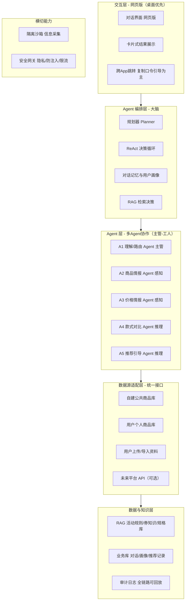
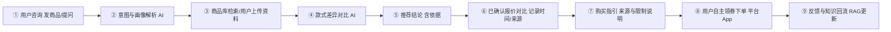
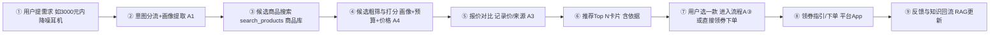

# 智能导购 Agent（购物决策助手）— 设计方案底稿

> 状态：**v0.6 开发目标定为网页版** · 共同设计讨论用文档，可直接在本文件修改
> 更新日期：2026-09-28
> 版本说明：v0.1 为"智能电商采购 Agent"（AI 自动下单），经可行性论证后转型为 **v0.2 智能导购 Agent**——AI 只做信息聚合与决策建议，交易 100% 由用户完成；**v0.3 价格情报优化**——原计划接入联盟 API，现调整为带来源和时间的商品报价记录，不承诺实时最低价；**v0.4 网页版定位**——开发目标调整为"网页版（桌面优先）"，小程序/App 降级为远期路线；对话方式支持图片输入；**v0.5 推荐商品功能**——从自建商品库按需求、画像和预算给出 Top N 推荐；**v0.6 新增功能模块**——新增"心愿单与购买决策、个人物品库、消费记录与预算"三大模块，数据以手动录入＋截图辅助识别＋文件导入起步，不宣传自动同步平台订单
> 标注说明：`⏳` 表示待拍板的决策点；`[x]` 为已定决策；`[ ]` 为可勾选清单

---

## 1. 项目定位

一句话定位：**网页版商品整理与购买决策助手**——用户可以维护自己的商品资料和报价记录，也可以使用经过审核的公共商品库；Agent 根据商品规格、用户画像、预算和带时间的报价记录做款式对比与推荐。**下单这一步交给用户自己完成。**

- 核心原则：**AI 是顾问，不是代购**——不碰登录态、不碰支付、不碰资金
- 网页版为当前开发目标，**桌面端优先**（桌面浏览器为主要使用场景）
- 产品形态路线：**网页版先行跑通（当前目标）→ 微信小程序 / App 保留为远期路线**
- 商业策略：**不提供推广链接**，顾客通过自己找券参加活动获得最低价（透明、不误导、建立信任）

**已定决策（v0.2）**：
- [x] 交易 100% 由用户完成，系统不做任何下单/支付动作
- [x] 不提供 CPS 推广链接，改为"领券指引"让用户自己找券
- [x] 隐藏券/渠道专享券：向用户说明使用限制，提供"能否领到券"两个价格（公开价 vs 领券价）
- [x] 开发目标为网页版（桌面优先）；微信小程序 / App 仅保留为远期路线
- [x] 桌面端为第一优先级
- [x] **推荐商品（无目标商品场景）纳入核心流程**：按需求跨平台搜索候选商品 + 画像/预算匹配 + Top N 推荐卡片（v0.5 新增）

---

## 2. 总体架构


```mermaid
flowchart TB
    subgraph U["交互层 - 网页版（桌面优先）"]
        A1["对话界面 网页版"]
        A2["卡片式结果展示"]
        A3["跨App跳转 复制口令引导为主"]
    end
    subgraph B["Agent 编排层 - 大脑"]
        B1["规划器 Planner"]
        B2["ReAct 决策循环"]
        B3["对话记忆与用户画像"]
        B4["RAG 检索决策"]
    end
    subgraph C["Agent 层 - 多Agent协作（主管-工人）"]
        C1["A1 理解/路由 Agent 主管"]
        C2["A2 商品情报 Agent 感知"]
        C3["A3 价格情报 Agent 感知"]
        C4["A4 款式对比 Agent 推理"]
        C5["A5 推荐引导 Agent 推理"]
    end
    subgraph D["数据源适配层 - 统一接口"]
        D1["自建公共商品库"]
        D2["用户个人商品库"]
        D3["用户上传/导入资料"]
        D4["未来平台 API（可选）"]
    end
    subgraph E["数据与知识层"]
        E1["RAG 活动规则/券知识/规格库"]
        E2["业务库 对话/画像/推荐记录"]
        E3["审计日志 全链路可回放"]
    end

    U --> B --> C --> D --> E

    subgraph X["横切能力"]
        X1["隔离沙箱 信息采集"]
        X2["安全网关 隐私/防注入/限流"]
    end
```

**架构核心判断**：系统是**商品资料与决策服务**——读取自建商品库、用户上传资料和报价记录，不产生任何交易动作。平台 API 或公开页面只能作为未来可插拔的导入来源，不能绕过登录、验证码或反爬限制。安全重心是数据隔离、来源可追溯和防止过期报价误导。

---

## 3. 核心设计

### 3.1 多 Agent 设计（主管-工人模式，5 Agent）

**主张**：信息采集型（碰外部 API）与推理型（纯 LLM）分离；感知型独立成 Agent，推理型合并职责，避免过度拆分。

**五个 Agent 职责与边界**：

| Agent | 类型 | 职责 | 输入 | 输出 | 碰外部 API？ |
|-------|------|------|------|------|------------|
| A1 理解/路由 | 主管 | 意图解析（款式对比 / **推荐商品** 分流）、画像提取、任务路由、对话管理 | 用户消息+历史 | 结构化任务清单+画像 | 否 |
| A2 商品情报 | 工人·感知 | 商品库定位 + SKU 款式整理 + **候选商品搜索（推荐场景用）** | 商品标识/关键词/需求描述 | 款式信息矩阵 / **候选商品列表** | ✅ 商品库与导入适配层 |
| A3 价格情报 | 工人·感知 | 汇总已确认报价、标记时间和来源、计算可比价格 | 款式列表 | 报价矩阵（金额/平台/观察时间/来源/可信度） | ✅ 商品库 |
| A4 款式对比 | 工人·推理 | 款式差异对比、规格补全、**候选商品粗筛/打分（推荐场景用）** | 款式矩阵+RAG 规格库 | 结构化对比结论 / **推荐候选排序** | 否 |
| A5 推荐引导 | 工人·推理 | 画像匹配、推荐生成（含 **Top N 推荐卡片**）、领券指引 | 对比结论+价格矩阵+画像 | 最终回复（含免责） | 否 |

**三个关键设计原则**：
1. **Agent 间传结构化数据（JSON Schema 契约），不传自然语言**——避免级联式转述累积幻觉与误差；共享状态只有数据契约
2. **感知型与推理型分权限**——只有 A2/A3 持有商品库和导入工具，A4/A5 纯推理；上传或外部返回的原始数据只在导入隔离层清洗成结构化数据后才进入共享状态
3. **拆分理由**：商品规格低频、报价按记录时间变化、导入任务异步处理；独立权限（感知 vs 推理）——据此 A2/A3 必拆，A4/A5 合并

**命名约定**：统一使用"查询/采集/导入/情报"；不把页面读取或不稳定数据源描述为实时爬取能力。

### 3.2 数据源：自建商品库与用户上传（平台 API 可选）

**核心结论**：当前商品信息不依赖联盟 API。系统以自建商品库为事实源，支持用户手动录入、CSV 导入、图片/截图和文本辅助识别；识别结果必须由用户确认后才能进入个人商品库。未来获得平台 API 时，只增加导入适配器，不改变商品库和对比契约。

**数据来源能力矩阵**：

| 来源 | 方式 | 可进入库中的内容 | 状态 |
|------|------|------------------|------|
| 公共商品库 | 管理员/审核人员录入或审核用户投稿 | 商品主档、SKU、稳定规格、来源引用 | 审核通过后可被公共检索 |
| 个人商品库 | 用户手动录入、CSV 导入 | 用户自己的商品主档、SKU、报价和备注 | 默认私有，立即可用 |
| 图片/截图/文本 | OCR/LLM 辅助提取 | 仅生成待确认字段，不自动发布 | `draft`，由用户确认 |
| 公开页面/未来平台 API | 可选导入适配器 | 仅保存允许读取的公开字段和来源 | 不绕过登录、验证码或反爬 |

**商品库适配层接口**：

```text
search_products(keyword, scope)  → 库内候选商品列表（public | mine）
get_product_detail(product_id)   → 商品主档 + SKU + 已确认来源
list_quotes(product_id)          → 报价记录（平台/金额/时间/来源）
create_import_task(payload)      → 上传解析任务 + 待确认字段
confirm_import(task_id, fields)  → 用户确认后写入个人商品库
```

> **推荐商品场景的接口用法（v0.5）**：推荐流程由 `search_products(需求关键词, scope)` 起步，在公共库和当前用户个人库中获取候选，再读取已确认报价和规格，按画像/预算打分排序后输出 Top N。库存不足时明确提示，不硬凑推荐。

**价格展示策略（新口径）**：

```text
报价必须显示：平台、金额、币种、记录时间、来源类型、来源引用和确认状态。
报价属于观察值，不承诺实时价或全网最低价；缺少确认报价时显示“暂无价格记录”。
```

**优惠类型获取策略（v0.3 新增）**：

**结论**：价格情报来自商品库中的用户报价和审核报价；优惠券、会员价、红包等没有可验证来源时只作备注或指引，不参与最低价结论；不抓取评论区。

| 信息类型 | 是否进入价格计算 | 处理方式 |
|---------|------------------|---------|
| 用户确认的商品报价 | ✅ | 按金额、平台、记录时间和来源展示 |
| 用户备注的券/活动 | ❌ 默认不计入 | 作为备注或领券指引，除非用户明确确认实付金额 |
| 会员价、红包、限时折扣 | ❌ | 标记为个性化权益，提示以页面实时价为准 |
| 无来源或未确认价格 | ❌ | 只保留在草稿，不进入推荐排序 |

**为什么不把评论区或平台页面抓取作为数据源（三重否决）**：

1. **数据质量**：晒单滞后于活动、覆盖随机、刷单污染——对"当前能否领到券"无参考价值
2. **技术反爬**：评论接口需登录态 + 签名 + 风控，维护成本高且随时失效
3. **合规**：批量抓取可能违反平台用户协议；突破反爬技术措施存在法律和账号风控风险；与当前“自建库、用户确认、来源可追溯”的定位冲突

**处理原则**：只有带来源、时间并经过确认的报价才参与价格比较；券、会员价、红包和限时折扣在没有可验证实付金额时只做备注或指引，不伪装成实时最低价。

> 原则：**信息透明、不误导**。用户无法自己领到的券，必须说明限制，不能只报低价。

### 3.3 网页版产品形态（桌面优先）

**载体选型**：

| 阶段 | 载体 | 说明 |
|------|------|------|
| 当前 | **网页版（桌面优先）** | 全品类 Mock，跑通核心咨询流程；前端技术栈暂未确定，现有 Vue3 + Tailwind 探索工程 `frontend-web/` |
| 远期 | **微信小程序** | 免安装、微信内对话、分享裂变、可唤起 App（保留路线，暂不投入） |
| 后期 | App | 体验最佳，成本最高（保留路线，暂不投入） |

**网页版关键机制**：
- 对话式交互（发文字 / 商品链接 / 图片——图片输入属模型多模态能力，由所选 LLM 支持度决定）
- 卡片式结果（推荐商品 Top N 卡片、推荐结论、款式对比表、双价、领券步骤按钮）
- 跨 App 跳转：以**复制口令引导为主**——网页版内展示/复制商品口令（淘宝口令/京东口令/拼多多口令），用户在平台 App 内粘贴跳转；URL Scheme 作备选。平台原生能力，无需推广身份，完全合规

### 3.4 隔离沙箱

**主张**：本产品无交易写操作，沙箱用于隔离用户上传和可选公开信息导入。

1. **进程级隔离起步**（Demo 阶段足够），容器级可选
2. **网络白名单**：默认不需要访问平台；启用公开信息导入时只放行明确允许的域名
3. **凭据隔离**：未来平台 API 凭据只存后端服务端，不进 Agent 上下文
4. **只读约束**：沙箱内 Agent 只能调查询类工具，无任何写操作工具
5. 全量审计：每次查询的输入/输出可回放

### 3.5 安全与隐私

**威胁模型（导购版）**：

| 严重度 | 威胁 | 对策 |
|--------|------|------|
| 高 | 用户隐私泄露（画像/购物记录） | 最小化采集 + 加密存储 + 用户可删除 |
| 高 | 推荐误导（价格失真/券信息过期） | 实时查券 + 价格来源标注 + 免责声明 |
| 中 | Prompt 注入（商品描述夹带恶意指令） | 指令隔离 + 外部数据与指令分离 |
| 中 | 接口滥用/抓取 | 限流 + 白名单 + 审计 |
| 中 | 千人千面权益误承诺（天降红包/限时折扣） | 不参与价格计算，仅规则指引 + "以页面为准"提示 |
| 基座 | 审计缺失 | 全链路 trace_id |

**隐私合规**：对话中采集的用户画像（预算、偏好、场景）最小化、加密、可删除，符合《个人信息保护法》。

### 3.6 RAG（检索增强生成）

**知识源**：
- 平台活动规则：各平台大促玩法（双11/618/百亿补贴/满减凑单）、会员权益（PLUS、淘金币）
- 平台通用权益规则：淘金币抵扣规则、消费券发放节奏、天降红包/限时折扣的账号属性说明（这类权益千人千面，只做指引、不做承诺）
- 券知识：券类型（公开券/渠道专享券）、领券路径、使用限制
- 商品规格库：常见品类 SKU 参数体系（辅助款式对比）
- 用户历史画像（脱敏）：历史咨询与偏好

**三个落点**：

| 落点 | 场景 | 检索内容 | 作用 |
|------|------|---------|------|
| 款式对比 | SKU 参数补全 | 商品规格库、详情数据 | 参考 |
| 价格测算 | 活动价计算 | 平台活动规则 | **硬约束**（算错会误导） |
| 领券指引 | 生成步骤 | 券类型与领券路径 | **硬约束**（说错用户领不到） |

**技术栈**：**PostgreSQL 16 + pgvector**。知识库独立于业务库 MySQL，但**原文与向量在同一个库里**——知识原文、切片、embedding、时效与过滤字段全在 PG，检索**一条 SQL 直接返回原文，不需要回表**。

> **2026-09-27 修订（大宋拍板）**：业务库 = **MySQL 8**（用户侧数据）；知识 / 向量库 = **PostgreSQL 16 + pgvector**。
> 演变过程：`PostgreSQL + pgvector`（最早，业务库也用 PG）→ `MySQL + Milvus`（业务库改 MySQL 后）→ **`MySQL + PostgreSQL/pgvector`（现行）**。
> **换掉 Milvus 的依据**（知识只有千条级、少 3 个容器、同库同事务、原生 SQL 过滤）见 `docs/用户注册与登录-接口契约.md` **§8.2 第 6 条**；完整规格（表结构 / 检索 SQL / 灌库 / 迁移 / M3 排期）见 **§8**。

### 3.7 推荐商品（无目标商品场景，v0.5 新增）

**场景定义**：用户没有明确目标商品，只提出需求描述（如"3000 元以内降噪耳机""学生党性价比键盘"）。区别于既有"指定商品→款式对比"路径，本功能从**品类/需求关键词**出发，产出**推荐商品 Top N 卡片**。

**流程定位**：推荐商品是独立入口流程，与款式对比流程共用数据源适配层、双价测算与领券指引能力；用户在推荐卡片中选择某款后，可无缝进入"款式对比"流程继续深挖。

**推荐排序依据（画像 + 价格 + 需求，A4 粗筛打分）**：

| 排序因子 | 权重 | 说明 |
|---------|------|------|
| 预算符合度 | 高 | 最低到手价 ≤ 用户预算优先；超预算需明确提示 |
| 画像匹配 | 高 | 价格敏感→优先券后低价；品质优先→优先旗舰/高配；学生→学生友好渠道 |
| 平台偏好 | 中 | 用户常用平台（淘宝/京东/拼多多）优先展示 |
| 价格竞争力 | 中 | 同款已确认报价中的较低记录，优先较新来源 |
| 口碑/销量参考 | 低 | 仅使用用户明确录入或审核资料，不读取评论区 |

**Top N 输出规范**：
- 数量：默认 Top 3（可配置），候选池先按需求关键词 `search_products` 收敛
- 每张卡片包含：商品名 / 一句话推荐理由（对应排序因子）/ 已确认报价摘要 / 来源与记录时间
- 若候选不足或预算内无结果：明确告知并给出预算调整建议，不硬凑推荐
- 推荐理由必须可追溯到画像或价格数据（延续"信息透明、不误导"原则）

**前端承载**：网页版对话中输出"推荐商品卡片流"（同 3.3 卡片式结果）；首页可增设"热门推荐"入口作为推荐场景的快捷进入。

---

## 4. 新增功能模块（v0.6）：购物全生命周期管理

**定位**：在"导购决策"核心之上新增三个模块，把产品从"买之前"延伸到"买之后"——**心愿单与购买决策**（把"想买"管理起来）、**个人物品库**（买完以后软件仍然有用）、**消费记录与预算**（知道自己怎么买、花了多少）。三模块与核心咨询/比价流程共用用户体系（MySQL 业务库）与推荐能力；数据以用户手动录入、截图/小票/文件上传为主，识别结果由用户确认，**不宣传自动同步平台订单**。

### 4.1 心愿单与购买决策：把"想买"管理起来

收藏夹通常只负责存链接——把它做成一个真正的"购买待办"。用户把商品放进去时，可以记录：**价格变化曲线、为什么想买、最多愿意花多少钱、什么时候需要、是必需品还是改善型消费**。

| 能力 | 说明 |
|------|------|
| 跨平台收藏 | 粘贴受支持的商品链接，集中保存；无法解析时允许手动补充 |
| 购买优先级 | 结合预算、截止时间和需求排序，由用户最终确认 |
| 冲动消费冷静期 | 用户选择等待几天后再提醒，**不默认阻止购买** |
| 替代关系 | 把"这三款耳机只买一个"归成同一组 |
| 购买理由回顾 | 过一段时间询问"这个需求还存在吗"，帮助清理无效心愿 |

**产品价值**：用户即使当天不购物，也有理由打开软件整理自己的计划。

### 4.2 个人物品库：买完以后，软件仍然有用

与普通导购软件的核心区别模块。用户**拍照、手动录入或上传订单截图**后，为物品建立档案：**物品名称、型号、购买日期、购买价格、保修期限、发票、使用说明书、存放位置**。

| 功能 | 具体用途 |
|------|---------|
| 保修到期提醒 | 提醒用户检查仍有问题的设备，保修期限以凭证为准 |
| 维护提醒 | 净水器换滤芯、空气净化器清理、设备保养 |
| 耗材匹配 | 根据已确认型号查找兼容滤芯、配件、替换件 |
| 重复购买提示 | 添加新商品时提示家中可能已有同类物品 |
| 说明书助手 | 从用户上传的说明书中回答清洁、设置等问题 |
| 闲置标记 | 将不再使用的物品放入待出售或待赠送清单 |

**与现有能力的连接**：到更换耗材、购买配件、升级设备时，自然回到商品推荐和比价功能。

**开发建议**：先做"手动录入＋截图辅助识别＋提醒"。识别出的金额、型号和日期让用户确认，不需要一开始接入全部购物账号。

### 4.3 消费记录与预算：帮用户知道自己怎么买、花了多少

不必做成复杂的记账软件，只聚焦购物相关支出。用户手动记录或上传小票、订单截图后，软件自动提取金额并建议分类，确认后生成：**本月购物支出、不同类别占比、预算余额、待购买清单预计支出、退款后的实际支出**。

| 功能 | 说明 |
|------|------|
| 购物前看预算 | "如果购买这件商品，本月数码预算将超过你设置的限额" |
| 购物后做复盘 | 让用户标记"经常使用""很少使用""已退货"，了解哪些购买更值得 |
| 单次使用成本 | 用户记录使用次数后，计算"价格÷使用次数"，适合相机、露营装备等，不必所有品类都做 |

**差异化连接**：消费记录与物品库联动——购物前看预算做拦截提示，购物后标记使用情况做复盘，两者都落在"这笔钱花得值不值"上。

**边界**：不宣传自动同步所有平台订单，除非确实有相应授权接口；早期手动录入、截图识别和文件导入就足够验证需求。

### 4.4 模块联动与开发优先级

- **数据闭环**：心愿单（想买）→ 购买 → 物品库建档（已买/在用）→ 消费记录归档（花了多少）；物品库的耗材/配件/升级需求回流到核心推荐与比价流程
- **开发优先级（起步）**：先做"手动录入＋截图辅助识别＋提醒"，识别出的金额/型号/日期由用户确认，不接入购物账号
- **待拍板（⏳）**：三模块的页面归属（独立页面 vs 对话内）、与用户画像/预算的联动口径、预算分类标准、物品库图片/说明书存储位置

---

## 5. 核心流程

**流程 A：指定商品 → 款式对比（既有主流程）**


```mermaid
flowchart LR
    A["① 用户咨询 发商品/提问"] --> B["② 意图与画像解析 AI"]
    B --> C["③ 商品库检索/用户上传资料"]
    C --> D["④ 款式差异对比 AI"]
    D --> E["⑤ 推荐结论 含依据"]
    E --> F["⑥ 已确认报价对比 记录时间/来源"]
    F --> G["⑦ 购买指引 来源与限制说明"]
    G --> H["⑧ 用户自主领券下单 平台App"]
    H --> I["⑨ 反馈与知识回流 RAG更新"]
```

**流程 B：推荐商品（无目标商品，v0.5 新增）**


```mermaid
flowchart LR
    P["① 用户提需求 如3000元内降噪耳机"] --> Q["② 意图分流+画像提取 A1"]
    Q --> R["③ 候选商品搜索 search_products 商品库"]
    R --> S["④ 候选粗筛与打分 画像+预算+价格 A4"]
    S --> T["⑤ 报价对比 记录价/来源 A3"]
    T --> U["⑥ 推荐Top N卡片 含依据"]
    U --> V["⑦ 用户选一款 进入流程A③ 或直接领券下单"]
    V --> W["⑧ 领券指引/下单 平台App"]
    W --> X["⑨ 反馈与知识回流 RAG更新"]
```

> 全程系统不产生任何交易动作；购买由用户自行完成。流程 B 与流程 A 共享商品库检索、报价记录、A5 购买指引与 RAG 知识层。

---

## 6. 技术栈建议

| 层次 | 选型 | 备注 |
|------|------|------|
| 前端（网页版） | **已冻结为 `frontend-web/`** | Vue3 + Vite 5 + Tailwind 4 + Phosphor Icons（`frontend-web/`）；另有 Vant 移动端版（`frontend/`）仅作参考 |
| 前端（远期） | 微信小程序（uni-app/Taro 复用 Vue 代码） | 远期路线，暂不投入 |
| 后端框架 | FastAPI（暂定） | **随产品开发调整，不锁死** |
| Agent 编排 | LangGraph | 状态图驱动 |
| LLM 接口 | OpenAI / Anthropic function calling | 工具调用为标准能力 |
| 业务数据库 | MySQL | 对话/画像/推荐等结构化业务数据 |
| 知识 / 向量数据库 | **PostgreSQL 16 + pgvector** | RAG 检索（活动规则/券知识/规格库）；承载**知识原文 + 切片 + embedding 一体**，与业务库 MySQL 分立；替代 Milvus |
| 缓存 / 临时状态 | Redis（M3/M6 起） | 导入任务、对话最近消息、短期报价读取缓存、限流与失败计数；Session 事实源仍为 MySQL |
| 沙箱 | 进程级（起步）→ Docker（可选） | 信息采集隔离 |
| 审计 | 结构化日志 + trace_id | 全链路可回放 |

---

## 7. 决策清单

### 已定决策

| # | 决策点 | 结论 |
|---|--------|------|
| 1 | 项目定位 | C 端购物决策助手（非采购自动化） |
| 2 | 交易责任 | 100% 用户自完成，系统零交易动作 |
| 3 | 推广链接 | 不提供，改为领券指引 |
| 4 | 隐藏券处理 | 说明限制 + 双价透明展示 |
| 5 | 产品形态 | 网页版先行跑通（桌面优先）；小程序/App 保留为远期路线 |
| 6 | 端优先 | 桌面端第一优先级 |
| 7 | Agent 架构 | 多 Agent（主管-工人，5 Agent：A1 路由 / A2 商品情报 / A3 价格情报 / A4 款式对比 / A5 推荐引导） |
| 8 | 商品信息获取边界 | 自建商品库为事实源；用户上传需确认；平台 API/公开页面仅作可选导入；不绕过平台限制、不抓取评论区 |
| 9 | Demo 范围 | 全品类（通用全品类 Mock） |
| 10 | 对话方式 | 文字 + 链接 + 图片输入（图片输入属模型多模态能力，由所选 LLM 决定） |
| 11 | 数据库选型 | **业务库 MySQL 8**（用户侧数据）+ **知识/向量库 PostgreSQL 16 + pgvector**（原文与向量同库）。2026-09-27 更新，替代原 `PG + pgvector` 与中途的 `MySQL + Milvus`，依据见契约 §8.2 |
| 12 | 推荐商品功能 | 纳入核心流程：无目标商品场景从 `search_products` 起步，按画像+预算+已确认报价打分输出 Top N 推荐卡片（默认 Top 3），与款式对比流程并列且可衔接 |
| 13 | 新增功能模块（v0.6） | 新增心愿单与购买决策、个人物品库、消费记录与预算三大模块，形成"想买—已买—在用—花了多少"闭环 |
| 14 | 冲动消费冷静期（v0.6） | 用户自选等待天数后再提醒，系统**不默认阻止购买** |
| 15 | 平台订单同步边界（v0.6） | 不宣传自动同步所有平台订单；早期手动录入＋截图识别＋文件导入验证需求 |
| 16 | 物品库起步方式（v0.6） | 先做"手动录入＋截图辅助识别＋提醒"，识别出的金额/型号/日期由用户确认 |

### 待决事项（⏳）

| # | 决策点 | 选项 | 建议 | 状态 |
|---|--------|------|------|------|
| 1 | 首批数据源 | 种子商品 / 用户个人库 / 公共审核库 | 个人库先行，公共库审核后开放；未来 API 作为可选适配器 | ✅ |
| 2 | 目标用户 | 泛 C 端 / 特定人群（学生/宝妈/数码） | 待定 | ⏳ |
| 3 | 变现路径 | 免费积累 / 会员订阅 / 广告 | 暂不锁死，先做产品 | ⏳ |
| 4 | 平台 API | 暂不依赖 / 后续接入 | 先完成商品库与用户上传闭环 | ⏳ |
| 5 | 新模块落地形态（v0.6） | 三模块页面归属（独立页面 vs 对话内）、预算分类口径、物品库图片/说明书存储 | 待定 | ⏳ |

---

## 8. 下一步建议（Demo 规划）

1. **网页版前端技术栈（已冻结）**：确定为 `frontend-web/`（Vue3 + Vite 5 + Tailwind 4）并转正；Vant 移动端版（`frontend/`）仅作参考，不再纳入二选一
2. **确定 Demo 数据源**：种子商品库 + 用户手动录入/CSV 导入；图片/文本识别只生成待确认草稿，不依赖平台 API
3. **定义 Demo 核心流程**：双流程闭环——流程 A「咨询 → 商品库检索/导入 → 款式对比 → 报价记录展示」；流程 B「提需求 → 库内候选搜索 → Top 3 推荐卡片 → 用户查看来源」
4. **输出物**：项目目录结构 + 商品库接口定义（含个人/公共 scope）+ 数据库表结构（商品、SKU、来源、报价、导入任务、推荐记录）+ 前端页面清单（商品导入 / 商品库 / 对话 / 款式对比 / 价格记录 / 推荐卡片）
5. **新增模块 Demo 范围（v0.6）**：心愿单 / 物品库 / 消费记录以"手动录入＋截图辅助识别＋提醒"起步，不接入平台订单同步；先确认三模块页面归属与数据表结构（见决策 #16 与待决 #5）

敲定 1、2 后即可输出 Demo 的完整实现方案。
